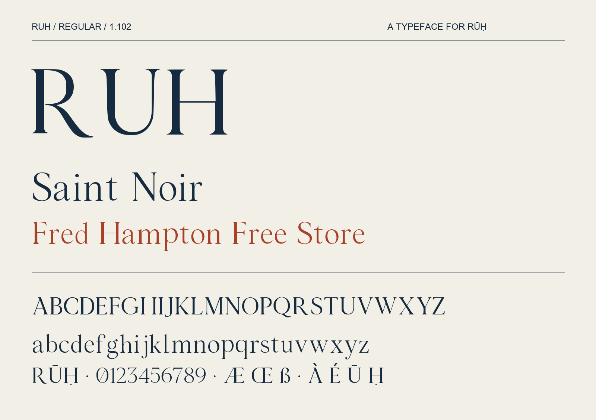

# RUH

**RUH Regular 1.102** is an OFL-licensed Latin display typeface created for concise brand statements and venue headlines. It was developed for RŪḤ, a fragrance atelier in New Orleans, with high-contrast serif strokes, open counters and a restrained editorial character.



## Use

Install `fonts/ttf/RUH-Regular.ttf` or `fonts/otf/RUH-Regular.otf`, choosing one format. The exact menu family is **RUH**; the style is **Regular**, weight 400. For self-hosted websites, use `fonts/webfonts/RUH-Regular.woff2` with an `@font-face` declaration naming `RUH`.

This is a display face, clearest at 48px and above. It contains 351 encoded characters and 365 glyphs, including all 319 required encoded characters in the tested GF Latin Core definition. It includes the macron U and dot-below H required for RŪḤ, common accented Latin, punctuation, currencies, proportional and tabular numerals, kerning and combining-mark attachment. Composed and decomposed RŪḤ shape equivalently.

One Regular style is supplied. Designed bold/italic styles, Arabic, Cyrillic and exhaustive auxiliary orthographies are not claimed. The font has not been accepted into Google Fonts.

## Source and build

The canonical source is `sources/RUH.ufo`, containing editable contours, Unicode assignments, metrics and OpenType features. The open-source build does not require image-generation accounts.

```sh
python3 -m venv .venv
.venv/bin/python -m pip install -r requirements.txt
RUH_FONT_PYTHON=.venv/bin/python ./build.sh
.venv/bin/python sources/check_release.py
```

Outputs are separated into `fonts/ttf`, `fonts/otf` and `fonts/webfonts`. [SOURCE-BUILD.md](SOURCE-BUILD.md) explains the pinned environment, deterministic production build and distinct standard fontmake compatibility command. [The reproducibility record](documentation/reproducible-build.json) records tested binaries and hashes. The [hosted Linux build/check workflow](https://github.com/smelllikeruh/ruh-font/actions/runs/34024691081) passed: all committed TTF/OTF/WOFF2 bytes reproduced, and release metadata checks passed. The build explicitly pins and requires the HarfBuzz serializer used by the reviewed release.

## Quality record

The current local checks verify reproducible TTF/OTF/WOFF2 output, valid OpenType files and unchanged outlines/layout. The full Google Fonts binary profile reports **112 PASS, 8 WARN, 8 INFO, 107 SKIP, 1 FAIL and 0 ERROR**. The one failure concerns the owner-selected uppercase family name RUH; no check was suppressed. Five applicable copyright and licensing checks pass.

See [the independent report](documentation/RUH-1.102-INDEPENDENT-QA.md) and [full FontBakery results](documentation/RUH-1.102-FontBakery-GoogleFonts.json). Conditional skips and warnings remain review items. A passing build workflow is separate from Google Fonts approval.

## Process and credits

Tariq Shaheed Johnson supplied project direction and commissioning. Initial Midjourney headline studies informed coordinated GPT Image letterform studies. Selected raster forms were traced, normalized and engineered with FontTools/UFO; supporting accents, punctuation, numeral alternatives and corrected forms include constructed vector geometry. The final editable UFO and build code are included here.

[AI-PROVENANCE.md](documentation/AI-PROVENANCE.md) explains this AI-assisted process. The project does not claim entirely hand-drawn letterforms or that an image service directly produced an installable font. AI tools are disclosed as tools, not human copyright signatories. The separate original image studies and unrelated RŪḤ artwork are outside this source release.

Project contact: use [repository issues](https://github.com/smelllikeruh/ruh-font/issues). See `AUTHORS.txt` and `CONTRIBUTORS.txt` for the stated roles.

## License

The font software, editable source, build scripts and included font documentation are released under the **SIL Open Font License, Version 1.1**, without Reserved Font Names. Read [OFL.txt](OFL.txt). The included specimen permission is recorded in `documentation/image-license.txt`. This release does not license unrelated brand photographs, Canva layouts or the owner's separate image library.

## Google Fonts status

Google Fonts review is pending. The owner specifically selected uppercase **RUH** as the family name. Google's normal naming rules require an exception for this capitalization; approval has not been granted. The separate contributor agreement, copyright-authority submission attestation and any onboarding fixes remain subject to the appropriate human and Google reviewers. Public OFL release is not catalog acceptance.

## Changelog

- **1.102 · 6 September 2026:** final public repository URL in copyright metadata.
- **1.101 · 6 September 2026:** owner-requested family rename to RUH and authorized OFL licensing.
- **1.100 · 6 September 2026:** reviewed letterforms, Latin Core coverage, corrected lowercase-l/accents, tabular numerals, kerning/mark behavior and deterministic UFO source.

The 1.101/1.102 changes preserve the reviewed glyph shapes and layout behavior.
